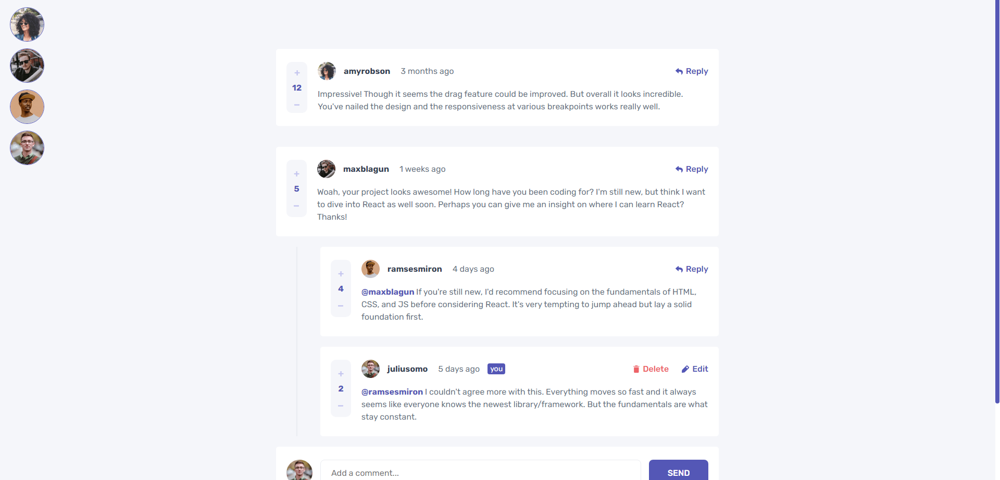

# **Interactive comments section | by zukicode**

_Hello everyone, this is a new front end mentor challenge that I have completed, it was an interesting project, it helped me to understand crud better, and I also became more familiar with typescript with the redux toolkit._

**Screenshot from website.**

#### Tech Stack:

1.  React
2.  Redux Toolkit
3.  TypeScript
4.  SCSS
5.  SCSS Modules
6.  Brain (a little bit, xddd)

_I'm glad I completed this project, without any code standards, just writing as I knew how._
